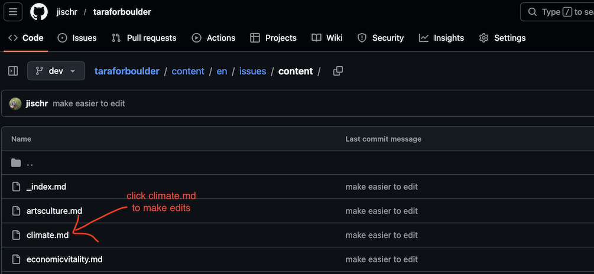
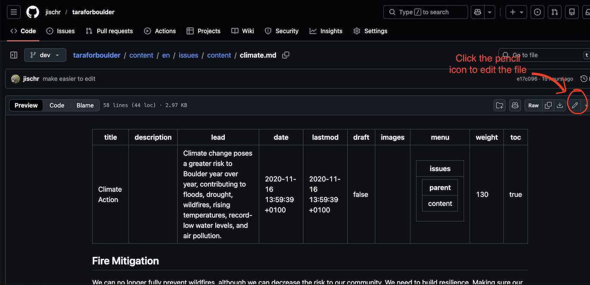
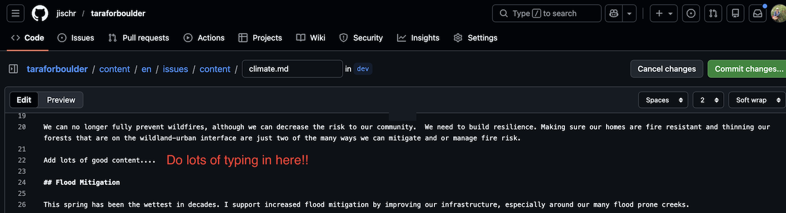
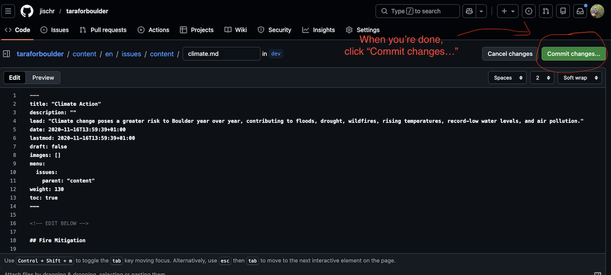
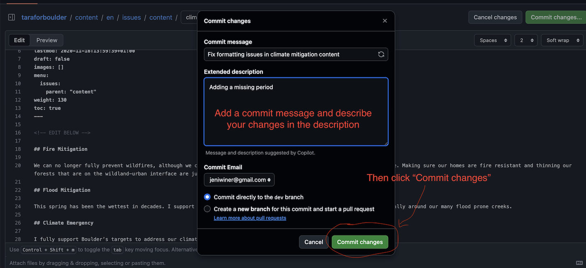

# Updating site content

This guide is for anyone who updates content on the Tara for Boulder site using **only the GitHub website**—no coding experience or special software needed.

---

## What you need

- A **GitHub account** (free to create at github.com)
- **Permission to edit** this project (you’ll see a pencil icon when you open a file). You save your changes to the draft area. The person who manages the site will move them to the live site when they’re ready.

---

## What to edit (file map)

**Not sure where to start? Come back to this README for the list below.**

| What you want to change | File to open on GitHub |
|------------------------|------------------------|
| **Live endorsers list** (what’s on the site now) | [data/endorsers-2023.yaml](data/endorsers-2023.yaml) |
| **Live quotes from supporters** | [data/quotes-2023.yaml](data/quotes-2023.yaml) |
| **Draft 2026 endorsers** (not live yet) | [data/endorsers-2026.yaml](data/endorsers-2026.yaml) |
| **Draft 2026 quotes** | [data/quotes-2026.yaml](data/quotes-2026.yaml) |
| **Issue pages** (e.g. transportation, housing, safety) | [content/en/issues/content/](content/en/issues/content/) — then open the file you need (e.g. `transportation.md`, `housing.md`, `safecommunity.md`, `homelessness.md`, `climate.md`, `economicvitality.md`, `artsculture.md`, `growth.md`) |
| **Bio** | [content/en/bio/index.md](content/en/bio/index.md) |
| **Experience** | [content/en/experience/index.md](content/en/experience/index.md) |

---

## How to edit a file on GitHub

1. Find the file you want to edit (see the **What to edit** table above) and click the link. It helps to open it in a new tab so you can still see these instructions.
2. If you’re editing an issue page, you’ll see a list of files (one per issue). Click the file you want (for example climate.md).

3. Click the **pencil icon** in the top right to start editing.

4. Make your changes in the text box.

5. When you’re done, click the green **Commit changes...** button in the top right. (On GitHub, “commit” just means *save*.)

6. Type a short note about what you changed (e.g. “Updated wording for transportation”) and click the green **Commit changes** button.

Your changes are now saved. You’ll see a confirmation at the top of the screen.

---

## Rules when editing

### Endorsers and quotes (files in the `data/` folder)

- To **add** someone or a quote, copy an existing entry and change the name, title, or quote.
- **Don’t remove or rename** the labels at the top of each section (e.g. `organizations:`, `elected_officials:`, `community:`).

**Endorsers:** Each person or group goes under one section. For **organizations**, each line is one name. For **elected officials**, **former officials**, and **board/commission**, each entry has `first_name:`, `last_name:`, and `title:`. For **community**, each entry has `first_name:` and `last_name:` (the list is sorted by last name). Copy an existing entry and change the values; keep the same spacing (2 spaces before each line under a label).

**Quotes:** Each quote has `name:`, `title:` (optional), and `quote:` (the quote text). Copy an existing quote block and change the text.

### Issue pages, Bio, and Experience

- **Edit only the content below the line that says `<!-- EDIT BELOW -->`.**
- Don’t change or delete anything **above** that line (the block at the top with the page title and description). If you need to change the page title or short description, ask someone who’s done it before or leave it as is.

---

## Making 2026 endorsements live (when ready)

The site currently shows 2023 endorsers and quotes. The 2026 lists are in `data/endorsers-2026.yaml` and `data/quotes-2026.yaml` and stay hidden until one setting is changed.

1. Open [config/_default/params.toml](config/_default/params.toml) on GitHub and click the pencil icon to edit.
2. Find the line: `endorsementsYear = "2023"`.
3. Change it to: `endorsementsYear = "2026"`.
4. Save the change the same way as above (Commit changes to the draft area). The 2026 content will then be ready; the live site will show it after the person who manages the site publishes the next update.

If you’re unsure about doing this, ask someone with access.

---

## After you save

Your changes are saved to the **draft area**. The **live site** (what the public sees) updates when the person who manages the site publishes the next update—so your content will appear on the live site then, not the moment you save.

---

For setup, building the site on your own computer, and how the site owner publishes updates, see [DEVELOPMENT.md](docs/DEVELOPMENT.md).
