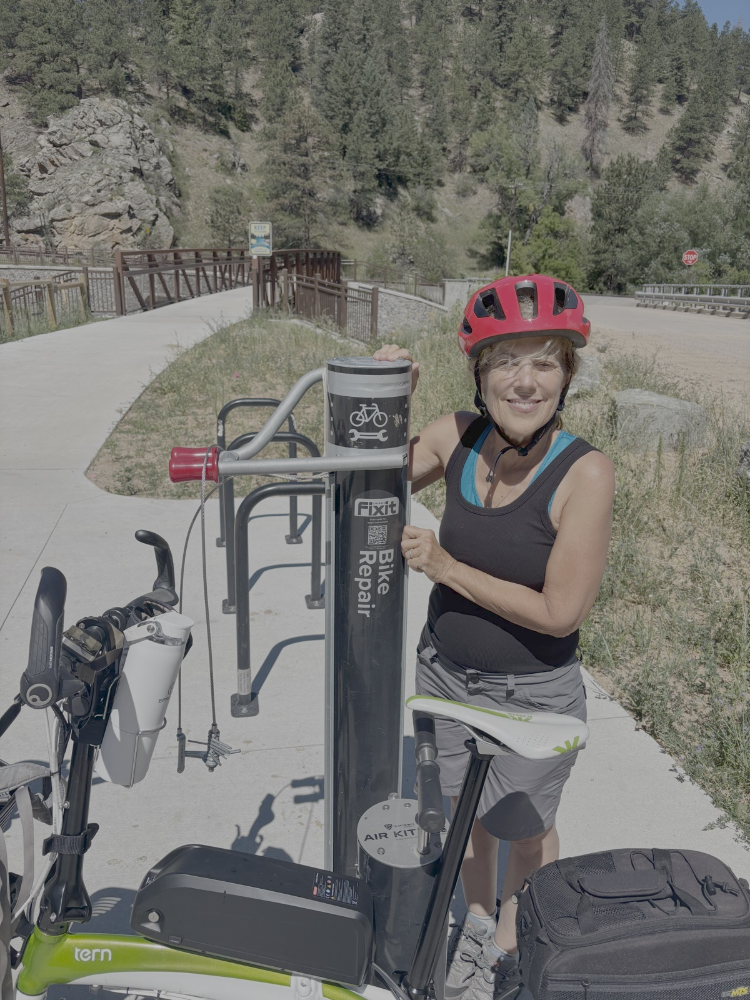
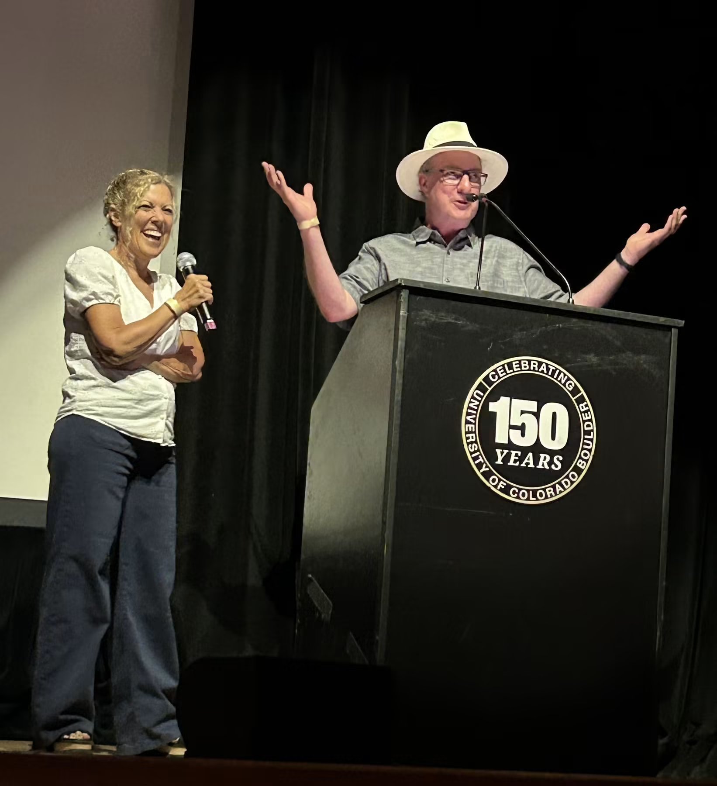
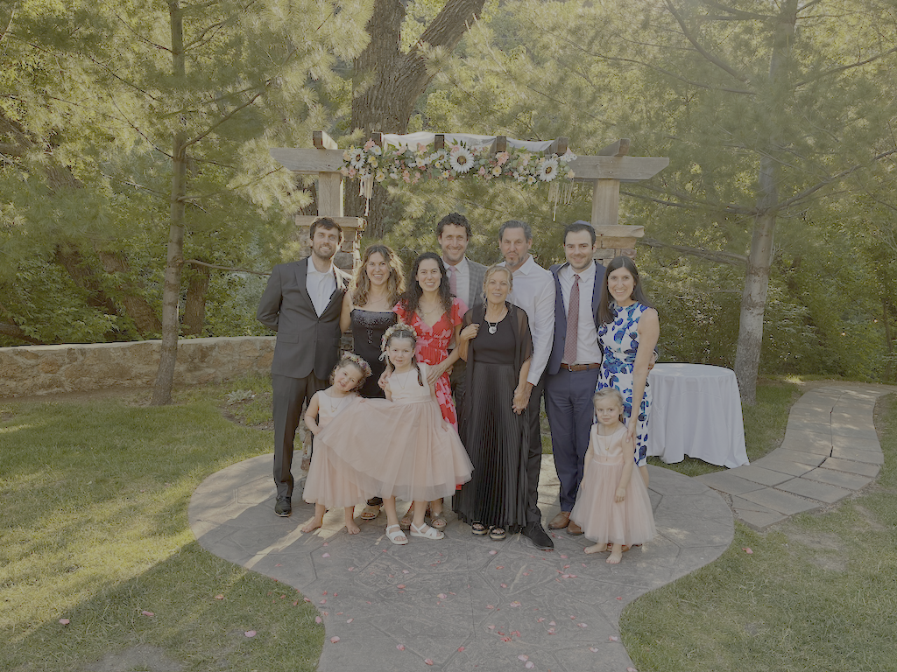

<!-- EDIT BELOW -->
<!-- Are you lost? Go back to the README for instructions: https://github.com/jischr/taraforboulder/blob/main/README.md -->
<!-- Photos: save real image files in this folder (content/en/fun-photos/). Do not use symlinks or links to other folders. -->

A glimpse of my life in Boulder. On the trail, with family and friends, and out in the community.

<figure>
  
  <figcaption>E-biking up Boulder Canyon</figcaption>
</figure>

<figure>
  
  <figcaption>Mayor Brockett and I speaking at the CU 150th Anniversary Event at the Fox Theater</figcaption>
</figure>

<figure>
  
  <figcaption>At the Juneteenth Parade in Denver with Joe Neguse and Council Member Tina Marquis</figcaption>
</figure>

<figure>
  
  <figcaption>My nephew's wedding up the Canyon</figcaption>
</figure>

